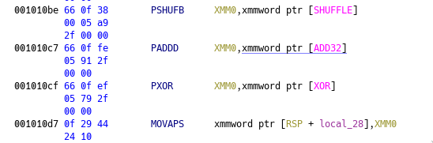

# Beginners

> Dust off the cobwebs, let's reverse!

Admittedly, this challenge made us quite struggle, although it's supposed to be the easiest reversing challenge.

The goal of this challenge is to break a obfuscation technique that is built with a few x86 Assembly SIMD instructions in order
to expand a known prefix of `"CTF{"` into the full flag.

## Introduction

Upon downloading the challenge from the server, you obtain a mysterious file called
`f0c3f1cbf2b64f69f07995ebf34aa10aed3299038b4a006b2776c9c14b0c762024bc5056b977d9161e033f80ff4517556d79af101088b651b397a27d4a89f2a1`.

With the help of the `file` command, it can be identified as a zip archive:

```sh
❯ file f0c3f1cbf2b64f69f07995ebf34aa10aed3299038b4a006b2776c9c14b0c762024bc5056b977d9161e033f80ff4517556d79af101088b651b397a27d4a89f2a1
f0c3f1cbf2b64f69f07995ebf34aa10aed3299038b4a006b2776c9c14b0c762024bc5056b977d9161e033f80ff4517556d79af101088b651b397a27d4a89f2a1: Zip archive data, at least v2.0 to extract

❯ unzip f0c3f1cbf2b64f69f07995ebf34aa10aed3299038b4a006b2776c9c14b0c762024bc5056b977d9161e033f80ff4517556d79af101088b651b397a27d4a89f2a1
Archive:  f0c3f1cbf2b64f69f07995ebf34aa10aed3299038b4a006b2776c9c14b0c762024bc5056b977d9161e033f80ff4517556d79af101088b651b397a27d4a89f2a1
 extracting: a.out
```

Aaaand there we go, we now have an `a.out` file, which is the real challenge. Another quick gaze at it with the `file` command further
reveals some important information:

```sh
❯ file a.out
a.out: ELF 64-bit LSB pie executable, x86-64, version 1 (SYSV), dynamically linked, interpreter /lib64/ld-linux-x86-64.so.2, BuildID[sha1]=e3a5d8dc3eee0e960c602b9b2207150c91dc9dff, for GNU/Linux 3.2.0, not stripped
```

We learn that we have a dynamically linked 64-bit ELF binary with debug symbols, so that's rather helpful for reversing.

So let's give it a shot:

```sh
❯ chmod +x a.out
❯ ./a.out
Flag: CTF{1234567890}
FAILURE
```

## Static Analysis

Alright, now that we have the binary, let's load it into Ghidra and analyze it.

An initial run on the `main` function gives us:

```c
ulong main(void)

{
  int iVar1;
  uint uVar2;
  undefined auVar3 [16];
  undefined local_38 [16];
  undefined4 local_28;
  undefined4 uStack36;
  undefined4 uStack32;
  undefined4 uStack28;
  
  printf("Flag: ");
  __isoc99_scanf(&DAT_0010200b,local_38);
  auVar3 = pshufb(local_38,SHUFFLE);
  auVar3 = CONCAT412(SUB164(auVar3 >> 0x60,0) + ADD32._12_4_,
                     CONCAT48(SUB164(auVar3 >> 0x40,0) + ADD32._8_4_,
                              CONCAT44(SUB164(auVar3 >> 0x20,0) + ADD32._4_4_,
                                       SUB164(auVar3,0) + ADD32._0_4_))) ^ XOR;
  local_28 = SUB164(auVar3,0);
  uStack36 = SUB164(auVar3 >> 0x20,0);
  uStack32 = SUB164(XOR >> 0x40,0);
  uStack28 = SUB164(XOR >> 0x60,0);
  iVar1 = strncmp(local_38,(char *)&local_28,0x10);
  if (iVar1 == 0) {
    uVar2 = strncmp((char *)&local_28,EXPECTED_PREFIX,4);
    if (uVar2 == 0) {
      puts("SUCCESS");
      goto LAB_00101112;
    }
  }
  uVar2 = 1;
  puts("FAILURE");
LAB_00101112:
  return (ulong)uVar2;
}
```

What immediately hits the eye is the crazy stuff that is going on with all the CONCAT, SUB, XOR and bit shifting.

To get a more clear picture of what this is supposed to be, let's take a closer look at the disassembler view:



Ugh, SIMD instructions! For all the weird shit the x86 architecture has, we had to admit that this is
quite a neat obfuscation technique!

To break down what the binary does:

* Print `Flag:` and ask the user for exactly 15 bytes of input (the 16th byte in the `local_38` buffer being a null byte)

* Apply the SIMD fuckery to the user input

* Compare the result of all this (`local_28`) to the original user input (`local_38`)

* If there's a match, do another comparison of the SIMD result (`local_28`) to the substring `"CTF{"` (`EXPECTED_PREFIX`) in the first 4 bytes

* If there's a match here too, print `SUCCESS`

* Otherwise, print `FAILURE`

## Analyzing the SIMD transformations

To solve this challenge, it is crucial to understand the role the SIMD instructions play in this.

```x86asm
        001010be 66 0f 38        PSHUFB     XMM0,xmmword ptr [SHUFFLE]                       = 
                 00 05 a9 
                 2f 00 00
```

The first instruction is `PSHUFB`, which operates on `XMM0` as the destination register, using the global variable `SHUFFLE`
as input:

```py
SHUFFLE = [
    0x02, 0x06, 0x07, 0x01, 0x05, 0x0b, 0x09, 0x0e,
    0x03, 0x0f, 0x04, 0x08, 0x0a, 0x0c, 0x0d, 0x00,
]
```

Considering that the user input is being loaded into `XMM0` right before this, the `pshufb` re-arranges all the characters/bytes
of our input in the order denoted by the `SHUFFLE` array. So `user_input[0]` becomes `user_input[2]`, as the first element of `SHUFFLE`
has the value of `2` and so on.

```x86asm
        001010c7 66 0f fe        PADDD      XMM0,xmmword ptr [ADD32]                         = 
                 05 91 2f                                                                    = null
                 00 00
```

The next instruction takes `XMM0` (which now has the result of the previous `pshufb` operation in it) as the destination operand and another
global variable called `ADD32` as the source input:

```py
ADD32 = [
    0xef, 0xbe, 0xad, 0xde, 0xad, 0xde, 0xe1, 0xfe,
    0x37, 0x13, 0x37, 0x13, 0x66, 0x74, 0x63, 0x67,
]
```

This time, every `n` in the range of 0 through 16 from `ADD32` gets added to the corresponding `n` in the `XMM0` register.

```x86asm
        001010cf 66 0f ef        PXOR       XMM0,xmmword ptr [XOR]                           = 
                 05 79 2f 
                 00 00
```

And last but not least, there's `PXOR` which takes yet again `XMM0` as the destination operand and another global variable `XOR` as its source:

```py
XOR = [
    0x76, 0x58, 0xb4, 0x49, 0x8d, 0x1a, 0x5f, 0x38,
    0xd4, 0x23, 0xf8, 0x34, 0xeb, 0x86, 0xf9, 0xaa,
]
```

This instruction works pretty similar to the previously detailed `paddd`, except that it XORs every `n` in `XMM0` with the corresponding `n` in the
`XOR` array and stores the result.

```x86asm
        001010d7 0f 29 44        MOVAPS     xmmword ptr [RSP + local_28],XMM0
                 24 10
```

`MOVAPS` just moves the results of all the operations on `XMM0` back into memory so that it can be used for the `strncmp` operations
with the variable `local_28`.

## Putting it all together

Now that we know how the program works, we reimplemented it in Python for a more dynamic approach to analysis.

```py
from struct import pack, unpack

SHUFFLE = [
    0x02, 0x06, 0x07, 0x01, 0x05, 0x0b, 0x09, 0x0e,
    0x03, 0x0f, 0x04, 0x08, 0x0a, 0x0c, 0x0d, 0x00,
]

ADD32 = bytearray([
    0xef, 0xbe, 0xad, 0xde, 0xad, 0xde, 0xe1, 0xfe,
    0x37, 0x13, 0x37, 0x13, 0x66, 0x74, 0x63, 0x67,
])

XOR = bytearray([
    0x76, 0x58, 0xb4, 0x49, 0x8d, 0x1a, 0x5f, 0x38,
    0xd4, 0x23, 0xf8, 0x34, 0xeb, 0x86, 0xf9, 0xaa,
])

def pshufb(data: bytes) -> bytes:
    assert len(data) == 16 and len(SHUFFLE) == 16
    return bytearray(data[SHUFFLE[i]] for i in range(16))

def paddd(data: bytes) -> bytes:
    assert len(data) == 16 and len(ADD32) == 16

    result = bytearray()
    for i in range(0, 16, 4):
        # The instruction processes data in 32-bit chunks.
        x = unpack("<I", data[i:i + 4])[0]
        y = unpack("<I", ADD32[i:i + 4])[0]

        result.extend(pack("<I", (x + y) & 0xFFFF_FFFF))

    return result

def pxor(data: bytes) -> bytes:
    assert len(data) == 16 and len(ADD32) == 16

    result = bytearray()
    for i in range(0, 16, 4):
        # The instruction processes data in 32-bit chunks.
        x = unpack("<I", data[i:i + 4])[0]
        y = unpack("<I", XOR[i:i + 4])[0]

        result.extend(pack("<I", x ^ y))

    return result


# Read the user input and sanitize it to 15 bytes + a null byte.
user_input_str = input("Flag: ")
user_input = user_input_str[:15].encode() + b"\x00"

# Apply the SIMD algorithm from the binary to it.
simd_result = pxor(paddd(pshufb(user_input)))

print(f"pxor(paddd(pshufb({user_input_str[:15]}))):")
print([i for i in simd_result])
```

So it was basically stepping through the program with GDB and comparing the contents
of `XMM0` with the output of the program until we had it working.

But this point was actually where the big confusion started to set in about the first usage of `strncmp`.

> We know that this shit shuffles, adds and XORs bytes with our input, how on earth are you supposed to get matching input and output?!

## The solution

...And then, 2 days later, I finally realized that we don't even have to pass the `strncmp` in the binary. The only info we have is that
the flag must start with the characters `"CTF{"`. So what if we actually determined all the missing characters by cyclically iterating
over a buffer starting with `"CTF{"` and replacing the missing bytes with the results of the corresponding `pshufb -> paddd -> pxor`
operations until all the characters are known? Seems like it's worth a shot.

```py
SHUFFLE = [
    0x02, 0x06, 0x07, 0x01, 0x05, 0x0b, 0x09, 0x0e,
    0x03, 0x0f, 0x04, 0x08, 0x0a, 0x0c, 0x0d, 0x00,
]

ADD32 = [
    0xef, 0xbe, 0xad, 0xde, 0xad, 0xde, 0xe1, 0xfe,
    0x37, 0x13, 0x37, 0x13, 0x66, 0x74, 0x63, 0x67,
]

XOR = [
    0x76, 0x58, 0xb4, 0x49, 0x8d, 0x1a, 0x5f, 0x38,
    0xd4, 0x23, 0xf8, 0x34, 0xeb, 0x86, 0xf9, 0xaa,
]

EXPECTED_PREFIX = b"CTF{"
PLACEHOLDER = -1


def simd_op(flag: list, i: int) -> (bool, int):
    # This is essentially the pxor(paddd(pshufb(flag))) operation from the original program.
    # See reimpl.py for details, although keep in mind that this operates on single bytes
    # rather than the full 32 bits. This means, an additional fixup step will be necessary
    # to produce correct data in the end whenever a byte crosses the 8-bit boundary.
    # The boolean value returned by the function indicates whenever that happens.
    if flag[i] == PLACEHOLDER and flag[SHUFFLE[i]] != PLACEHOLDER:
        sum = flag[SHUFFLE[i]] + ADD32[i]
        return (sum > 0xFF, (sum & 0xFF) ^ XOR[i])
    else:
        return (False, flag[i])


def build_flag(flag: list) -> list:
    # We start with 4 known characters, 16 characters are expected.
    # 4 repetitions of the algorithm are sufficient to cover all of them.
    for _ in range(4):

        for i in range(16):
            fixup_needed, result = simd_op(flag, i)

            # If a fixup is needed, increment the next value in the ADD32 table so that
            # the arithmetic carry is evened out.
            if fixup_needed:
                ADD32[i + 1] += 1

            # Overwrite the byte at the current position with the computed SIMD result.
            flag[i] = result

    return flag


# Build the flag starting with the "CTF{" prefix, followed by -1 values as
# unique placeholders for all empty values (since bytes are always unsigned).
flag = build_flag([i for i in EXPECTED_PREFIX] + [PLACEHOLDER] * (16 - len(EXPECTED_PREFIX)))
print("Flag:", "".join(map(chr, flag)))
```

And indeed, this seems to work out for us!

```sh
❯ ./solve.py
Flag: CTF{S1MDf0rM3!}

❯ ./a.out
Flag: CTF{S1MDf0rM3!}
SUCCESS
```
